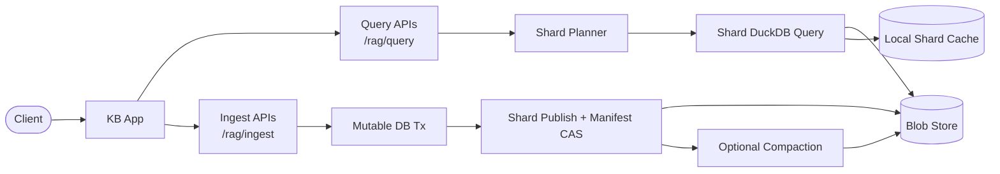
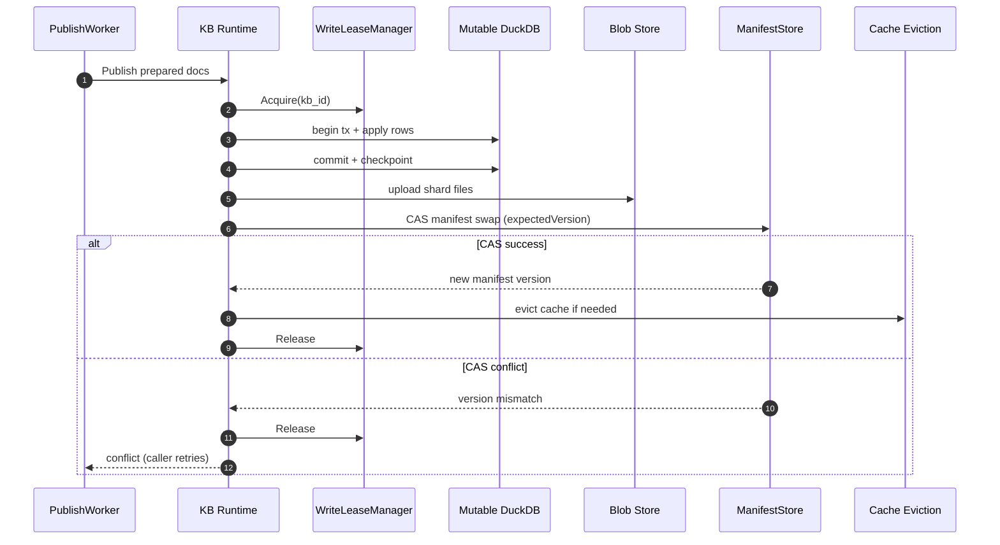
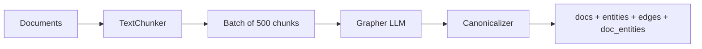

# Architecture

## Components

- **App server** - HTTP front door for `/rag/*`, `/healthz`, `/metrics/*`, `/cache/sweep`. Validates, maps errors, hands off to the runtime.
- **KB runtime** - orchestrates mutation, publish, query planning, and cache eviction per KB.
- **Event pipeline** - event store + stage-specific worker pools carry ingest and media-upload work to durable commit. See [data-lifecycle.md](data-lifecycle.md).
- **Manifest store** - pluggable per-KB CRUD with CAS semantics. Default: blob-backed. Also: Mongo.
- **Blob store** - content-addressed object storage for shard files. Local filesystem or S3.
- **DuckDB shards** - per-shard DuckDB files with docs, embeddings, and optional graph tables. Each has its own HNSW index.
- **Scheduler** - periodic jobs (cache sweep, media GC, compaction triggers) on a configurable tick.
- **Write lease manager** - per-KB-ID lease. In-memory single-pod, Redis multi-pod.
- **Local shard cache** - per-pod filesystem cache of shard files, with TTL + size-budget eviction.

## High-level flow

## Write concurrency

Two layers prevent lost updates:

| Layer  | Mechanism      | Scope                        |
|--------|----------------|------------------------------|
| Coarse | Write lease    | Per KB ID, cluster-wide      |
| Fine   | Manifest CAS   | Atomic manifest swap         |

- **Write lease** - one writer per KB at a time. Acquisition fails fast on conflict.
- **Manifest CAS** - the safety net. A writer reads the manifest version, does work, and passes the expected version to the CAS swap. On mismatch the swap returns a conflict; retry-capable callers re-read with quadratic backoff (`attempt² × 10ms`).

Shard files are immutable and content-addressed. A writer that loses the CAS race leaves orphaned shards that get collected on the next GC pass.

### Publish sequence (DB level)

## Graph extraction

Ingest with `graph_enabled: true` runs chunks through an LLM-backed extractor before shard publish.

Schema:

| Table          | Columns                                         | Purpose                             |
|----------------|-------------------------------------------------|-------------------------------------|
| `entities`     | `id` (PK), `name`                               | Canonical entity registry           |
| `edges`        | `src`, `dst`, `weight`, `rel_type`, `chunk_id`  | Directed relationships              |
| `doc_entities` | `doc_id`, `entity_id`, `weight`, `chunk_id`     | Doc-to-entity links via chunks      |

- Default chunk size: 500 bytes. Separator hierarchy: `\n\n` → `\n` → `.` → ` ` → chars.
- Entities inserted idempotently. Edge weights `≤0` normalise to `1.0`.
- Canonicalizer is optional - unconfigured, raw LLM-returned names are used.

## Cache model

Per-pod local filesystem. Eviction by TTL *and* size budget. Cache hits do no directory work. Requests fail with a budget-exceeded error when the cache cannot be satisfied within the retry window.
