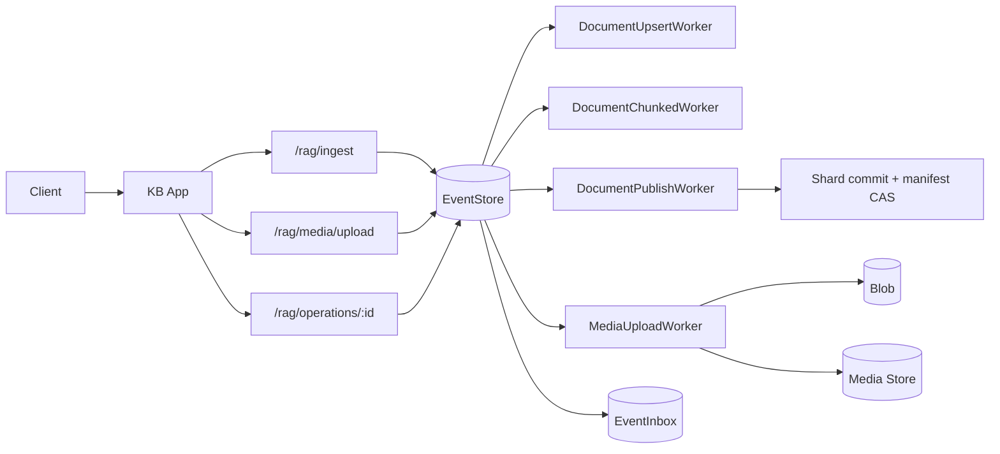

# Data & Pipeline

## Storage Model

Each KB is persisted as:

- Manifest: `<kb_id>.duckdb.manifest.json`
- Shards: `<kb_id>.duckdb.shards/<content-hash>/shard-xxxxx.duckdb`

Shards are content-addressed by source DB hash; identical shards uploaded concurrently are idempotent. There is no monolithic `<kb_id>.duckdb`.

Each shard is self-contained:

- `docs` - rows with HNSW-indexed embeddings (`id`, `content`, `embedding`, `media_refs`)
- `entities`, `edges`, `doc_entities` - graph tables, scoped to the shard's docs

Format version: **v2**. Manifests with any other version, or mixed-version shards, are rejected at load.

## Write Pipeline

Writes are event-driven. Requests append command events; worker pools claim by kind, perform the stage, append follow-up events, and ack the source only after durable commit. This gives at-least-once stage execution, durable lineage via `correlation_id` / `causation_id`, and post-commit dedup via an event inbox.

### Ingest stages

`document.upsert` → `document.chunked` → `document.embedded` or `document.graph_extracted` → `kb.published`

Publish stage:

1. Acquire per-KB write lease.
2. Materialize mutable state from current manifest shards.
3. Apply the mutation (tombstones for deletes, upsert for writes).
4. Checkpoint.
5. Split the snapshot into fixed-size shard DuckDB files, each with its own HNSW index. Rows assigned by doc-ID order; tombstoned rows excluded at build time.
6. Upload shards (content-addressed, idempotent).
7. Swap the manifest via CAS. On conflict, retry with bounded backoff.
8. Best-effort delete of pre-shard snapshot keys.
9. Cache eviction sweep.

### Media upload stages

`media.upload` → `media.uploaded`. The worker moves the staged blob to its final key, writes metadata, appends `media.uploaded`, deletes the staged blob, then acks.

## Event Model

Each event carries:

- `event_id`, `kind`, `kb_id`, `payload`
- `correlation_id` - request-wide lineage
- `causation_id` - immediate parent event
- `idempotency_key`
- `status` - `pending` | `claimed` | `done` | `dead`

Delivery is at-least-once. If a worker crashes after claim but before commit, the event is requeued after the visibility timeout and the handler runs again. Inbox dedup prevents double-commit; stage logic must be idempotent. Exhausted retries mark the event `dead`, surfaced on the correlation root as `worker.failed`.

`GET /rag/operations/:id` treats the original command event as the operation handle. Status resolution walks the causation graph until it finds a terminal event: `kb.published`, `media.uploaded`, or `worker.failed`.

Event-backed: document ingest, media upload. Query execution and intra-stage helpers are direct calls, not events.

## Query Path

`POST /rag/query` supports `search_mode=vector` (default), `graph`, and `adaptive`. Graph mode is strict: unavailable graph data fails the request with a 400.

Shard selection:

- `shards ≤ small_kb_max_shards` (default 2): all shards queried; centroid ranking skipped.
- Otherwise: rank by squared Euclidean distance from query vector to each shard's centroid. Select top `query_shard_fanout` (default 4). Shards without centroids fall back to descending vector-row count.

Selected shards run in parallel (bounded by `query_shard_parallelism`). Results merge globally by ascending distance; ties broken deterministically by ID, content, shard index, local index.

Cache-miss path for a shard: stat the file → SHA-256 → atomic rename into cache.

## Ingest API Contract

`POST /rag/ingest` requires `graph_enabled`:

- `true`: graph extraction is required for this request; fails if the graph builder is not configured.
- `false`: graph extraction is explicitly skipped.

## Compaction

Shards merge via size-tiered selection (log₂ bucketing relative to `target_shard_bytes`) or tombstone pressure (`TombstoneRatio ≥ compaction_tombstone_ratio`). Up to 4 shards per pass. Replaced shards are enqueued for delayed GC so in-flight readers finish before deletion.

## Snapshot Reconstruction

A snapshot can be rebuilt from the manifest:

1. Fetch the manifest.
2. For each shard: download, verify size, verify SHA-256.
3. Attach each shard read-only; insert docs and graph tables into a combined DB.
4. Build an HNSW index over the combined `docs` table.
5. Checkpoint, atomic rename to destination.
